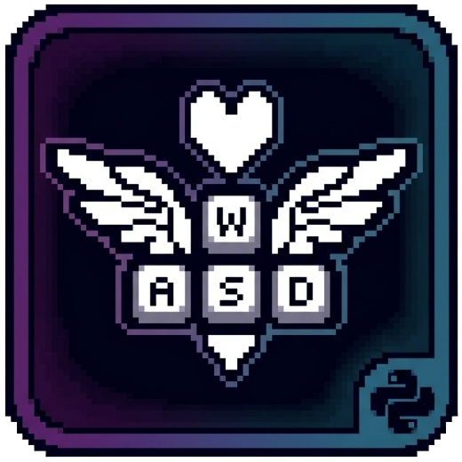

<p align="center">
  
</p>

<h1 align="center">Deltarune Key Remapper</h1>

<p align="center">
  <strong>Latest Version: v1.1.2</strong>
</p>

<p align="center">
  <a href="#english-version">English</a> •
  <a href="#русская-версия">Русский</a>
</p>

---

## English Version

Custom Deltarune keybind configuration script by FoxVuk. GUI-only key remapper with multi-profile support, hotkeys, and OSD overlay.

### How It Works

The game receives fixed target keys: **arrows, Z, X, C**. You choose which physical keys trigger them via GUI profiles. Set a key to **null** (press ESC during rebinding) to completely disable remapping for that key.

### Features

* **Multi-Profile Support**: Create, delete, rename, export, import profiles. Each profile has its own key bindings.
* **Default Profile**: Protected, auto-generated, cannot be deleted or renamed. Always reverts to default bindings.
* **Full Customization**: Rebind any source key to any target (Up/Down/Left/Right/Z/X/C) — in the GUI. Set to null to disable.
* **GUI Only**: PyQt6 window with profile selector, rebind buttons, settings.
* **Profile Hotkeys**: Ctrl+Alt+P+0 (Default) through Ctrl+Alt+P+9 (custom profiles).
* **Profile Limit**: 9 quick profiles with hotkeys (1-9), Default on 0. More can be created without hotkey.
* **OSD Overlay**: Borderless popup shows status for 2 seconds (toggle, kill switch, profile switch).
* **Full Diagonal Support**: Simultaneous key presses work perfectly.
* **Window Detection**: Warns when Deltarune window is not found or not focused.
* **Global Hotkeys**: `Ctrl+Alt+V` (toggle), `Ctrl+Alt+Backspace` (quit).
* **Auto Update Check**: Checks GitHub on startup. `sup` (ok), `notsup` (blocks), `alnotsup` (warning), `notreleased` (info).
* **Version Blocking**: Unsupported versions block until user updates.
* **Bilingual**: English and Russian, selectable in GUI on first run.
* **Configurable Logs**: Enable/disable logs, set log level (debug/info/warn/error).
* **Auto Migration**: Settings from all previous versions are automatically converted.
* **Profile Fallback**: Corrupted profiles are automatically removed.

### Default Bindings

| Action | Game gets | You press |
|--------|-----------|-----------|
| Up     | Up arrow  | W         |
| Down   | Down arrow| S         |
| Left   | Left arrow| A         |
| Right  | Right arrow| D        |
| Confirm| Z         | Q         |
| Cancel | X         | E         |
| Phone  | C         | R         |

### Profile Hotkeys

| Hotkey | Profile |
|--------|---------|
| Ctrl+Alt+P+0 | Default |
| Ctrl+Alt+P+1 | Custom 1 |
| Ctrl+Alt+P+2 | Custom 2 |
| ... | ... |
| Ctrl+Alt+P+9 | Custom 9 |

### Files

| File | Description |
|------|-------------|
| `profiles.json` | All profiles and their bindings |
| `preferences.json` | App settings (language, active profile, logs, etc.) |

### Installation & Launch

1. Install dependencies:
   ```bash
   pip install keyboard PyQt6
   ```
2. Optional (window detection):
   ```bash
   pip install pywin32
   ```
3. Run **as Administrator**.

### Safety

* Hooks ONLY the keys in your config. Nothing else is blocked.
* `Ctrl+Alt+Delete` always works (OS-level).
* `Ctrl+Alt+Backspace` — force quit instantly.

---

## Русская версия

Скрипт для изменения раскладки управления в Deltarune от FoxVuk. GUI-ремаппер с мульти-профилями, горячими клавишами и OSD-оверлеем.

### Как это работает

Игра получает фиксированные целевые клавиши: **стрелки, Z, X, C**. Вы выбираете какие физические клавиши их активируют через профили в GUI. Установите клавишу в **null** (нажмите ESC при переназначении) чтобы полностью отключить ремап для неё.

### Возможности

* **Мульти-профили**: Создавайте, удаляйте, переименовывайте, экспортируйте, импортируйте профили. У каждого свои привязки.
* **Профиль Default**: Защищён, генерируется автоматически, нельзя удалить или переименовать. Всегда возвращается к дефолтным привязкам.
* **Полная кастомизация**: Переназначьте любую клавишу — прямо в GUI. Установите null для отключения.
* **Только GUI**: Окно PyQt6 с выбором профиля, кнопками rebind, настройками.
* **Горячие клавиши профилей**: Ctrl+Alt+P+0 (Default) через Ctrl+Alt+P+9 (кастомные).
* **Лимит профилей**: 9 быстрых профилей с горячими клавишами (1-9), Default на 0. Больше можно создавать без горячей клавиши.
* **OSD-оверлей**: Безрамочное всплывающее окно показывает статус на 2 секунды (переключение, киллсвич, смена профиля).
* **Поддержка диагоналей**: Одновременные нажатия работают идеально.
* **Проверка окна**: Предупреждает, если окно Deltarune не найдено.
* **Горячие клавиши**: `Ctrl+Alt+V` (переключение), `Ctrl+Alt+Backspace` (выход).
* **Авто-проверка обновлений**: Проверяет GitHub при запуске. `sup` (ок), `notsup` (блокирует), `alnotsup` (предупреждение), `notreleased` (инфо).
* **Блокировка версии**: Неподдерживаемые версии блокируются до обновления.
* **Двуязычный интерфейс**: Английский и русский, выбор в GUI при первом запуске.
* **Настраиваемые логи**: Включение/выключение, уровень (debug/info/warn/error).
* **Авто-миграция**: Настройки со всех прошлых версий конвертируются автоматически.
* **Fallback профилей**: Повреждённые профили удаляются автоматически.

### Горячие клавиши профилей

| Горячая клавиша | Профиль |
|-----------------|---------|
| Ctrl+Alt+P+0 | Default |
| Ctrl+Alt+P+1 | Кастомный 1 |
| Ctrl+Alt+P+2 | Кастомный 2 |
| ... | ... |
| Ctrl+Alt+P+9 | Кастомный 9 |

### Файлы

| Файл | Описание |
|------|----------|
| `profiles.json` | Все профили и их привязки |
| `preferences.json` | Настройки приложения (язык, активный профиль, логи и т.д.) |

### Установка и запуск

1. Установите зависимости:
   ```bash
   pip install keyboard PyQt6
   ```
2. Опционально (проверка окна):
   ```bash
   pip install pywin32
   ```
3. Запустите **от имени администратора**.

### Безопасность

* Перехватывает ТОЛЬКО клавиши из вашего конфига. Ничего больше не блокируется.
* `Ctrl+Alt+Delete` всегда работает (на уровне ОС).
* `Ctrl+Alt+Backspace` — мгновенный выход.

---

## Credits

Developed by **FoxVuk** ([@FoxVukOff](https://github.com/FoxVukOff))

Source code: [github.com/FoxVukOff/deltarune-foxvuk-keybinds](https://github.com/FoxVukOff/deltarune-foxvuk-keybinds)

Feel free to open issues, suggest features, or contribute!
